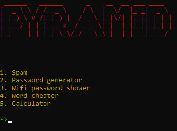

# PYramid

PYramid is an international tool for tech-lovers. 
It has currently 5 commands:

1. Spam
2. Password generator
3. Wi-Fi password shower
4. Word cheater
5. Calculator

To open the app in command line, you need to double-click on the PYramid.bat file. It will launch the program.

```HOW TO INSTALL THE REQUIRED MODULES?```

Type **pip install -r requirements.txt** in to your command line.
It will install all the modules what you need to setup PYramid.

```HOW TO SET UP PYramid.bat FILE?```

Go to the bat file, and copy the path of the python file(PYramid.py).
Then paste the full path to the bat file.



To return to the menu, hit Enter after the command finished.

If you have any further questions, or suggestions please contact with me on discord(R2#8184).

Copyright © 2022- Astro Solutions
